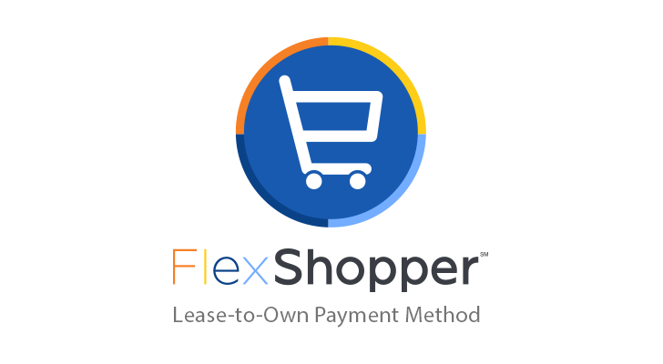
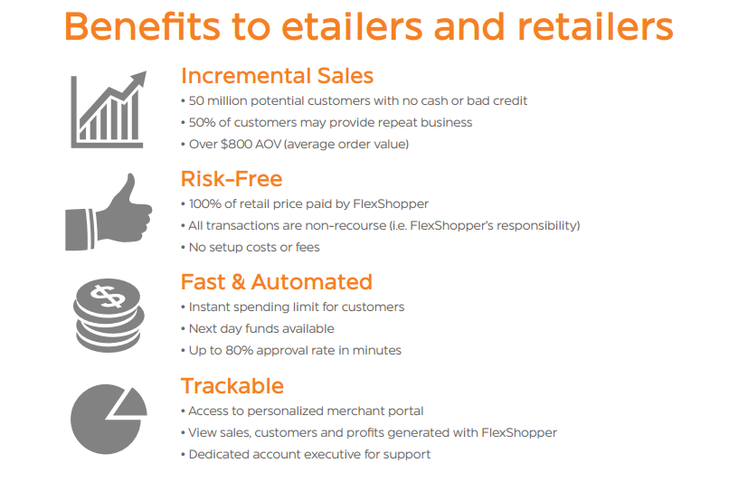

[](https://merchants.flexshopper.com)
[](https://merchants.flexshopper.com)

# FlexShopper (Lease to Own Payment Method)
FlexShopper is a new, alternative payment method that allows shoppers to lease to own the products they want. So, customers can get their favorite products from your store, while making affordable weekly payments over time.

This extension will allow you to easily integrate the FlexShopper Lease to Own Payment method into your Magento Store.

**Compatible with**

Magento CE 1.5+ and EE 1.1+

Install
-------
####To install using Magento Connect Manager
1. Login to the admin panel of Magento.
2. Visit `System > Magento Conenct > Magento Connect Manager`.
3. You might need to login again to connect manager with the same credentials as Magento's panel.
4. Place the extension key in the specificed field `http://connect20.magentocommerce.com/community/FlexShopper_Payment` as shown below:

[](https://merchants.flexshopper.com)

5. Click install.
6. Go back to Magento's adminpanel and flush cache by visiting `System > Cache Management`.

####To install using [modgit](https://github.com/jreinke/modgit)

```
cd MAGENTO_ROOT
modgit init
modgit -i plugin/:. add FlexShopper_Payment https://github.com/FlexShopper/Magento-FlexShopper.git
```
#####to update:
```
modgit update FlexShopper_Payment
```

Configuration
---------

1. Log in to your Magento Admin portal.
2. Visit System > Configuration > Payment Methods.
3. You will be shown a list of all payment methods in the system, look for the one called "FlexShopper Payment Method"
4. Make sure it is enabled.
5. Add your Retailer ID/Retailer token, [you can apply for those credentials via FlexShopper.com](https://merchants.flexshopper.com/)
6. (Show weekly price) option; gives you the ability to show our widget on your product pages as shown below. 
[](https://merchants.flexshopper.com)

7. Our payment method requires you to specify the Magento attribute related to the brands on your store, or you can fill the (Default manufacturer) field instead if you don't have one.

Below is how the configuration page for FlexShopper should look like:

[](https://merchants.flexshopper.com)

The ending result should be a new payment option for your customers at the checkout page:

[](https://merchants.flexshopper.com)

####Extension Features

1. The extension incorporates the best Magento development practices and flawlessly integrates into virtually any Magento theme.
2. The customer experience is easy and transparent. Customers have option to choose FlexShopper payment method during checkout and will be redirected to secure FlexShopper payment gateway to finalize their order.
3. With the extension admins have access to all standard order management actions like Invoices and credit memos.
4. FlexShopper Payment Gateway requires some additional information about the goods sold by a merchant. The information includes Manufacturer or Brand product attribute to be passed to the gateway. For that to work flawlessly the extension has a setting where merchant can assign attributes to be used to retrieve Manufacturer/Brand information for each product.
5. In case a merchant doesn’t use any Manufacturer/Brand attribute in his product catalog, he has the option to enter a default Manufacturer/Brand value to be used with a product that doesn’t have that information.

####FlexShopper Benefits

FlexShopper converts more customers and increases revenues:

Attract new customers who do not have sufficient cash or credit to make their purchase.
Reduce shopping cart abandons by offering an alternative payment option.
Fund 100% of the customers' purchases, with zero risk and zero transaction fees.
Quick, online application, where customers receive an instant spending limit.
Easy API integration to drive incremental sales for your business right away.

####About FlexShopper

FlexShopper is an innovative financial and technology company, disrupting the Lease-to-Own (LTO) industry by migrating the proven brick and mortar LTO model into the digital age.

We are an eCommerce marketplace and payment method for up to 50 million consumers that do not have sufficient cash or credit to buy durable goods.

By using our technology platforms, merchants increase their sales with no risk because FlexShopper pays 100% of the retail price. Consumers benefit from the ability to shop for the products they love, while paying only affordable weekly payments.
