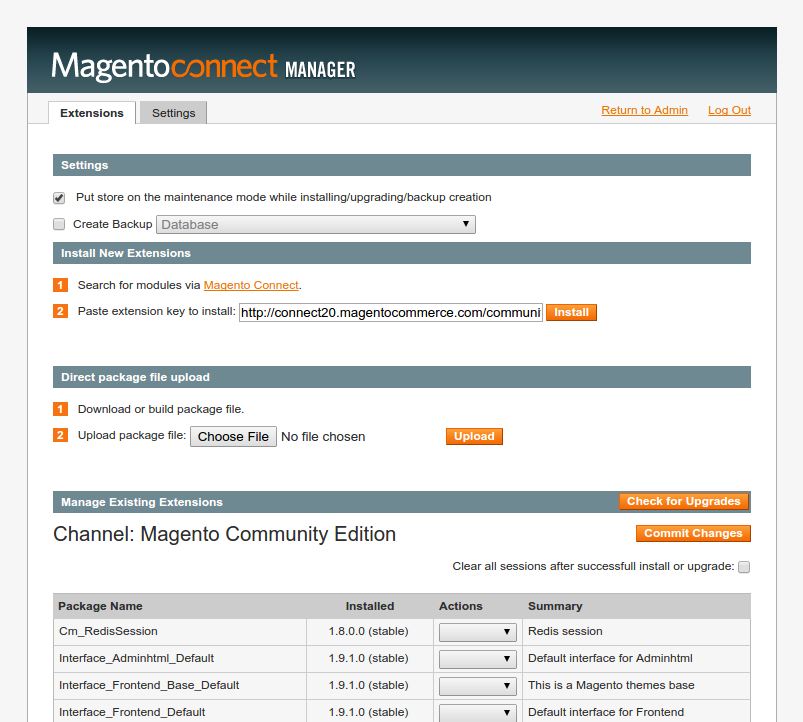
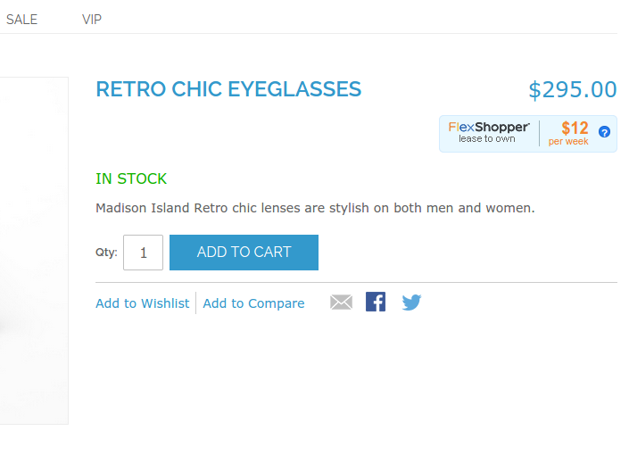
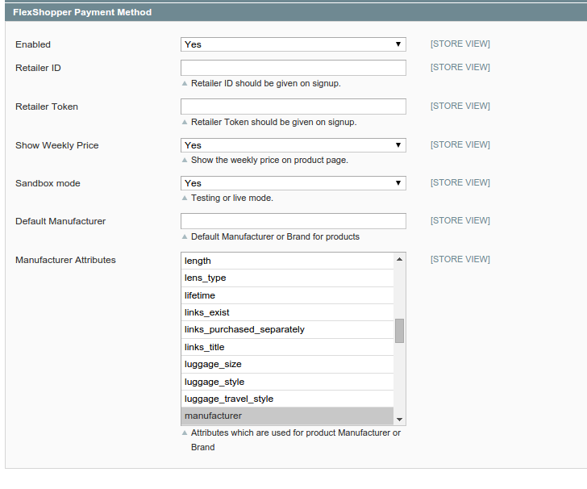
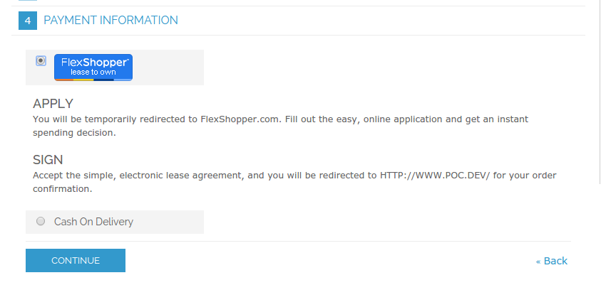

# FlexShopper (Lease to Own Payment Method)
FlexShopper is a new, alternative payment method that allows shoppers to lease to own the products they want. So, customers can get their favorite products from your store, while making affordable weekly payments over time.

This extension will allow you to easily integrate the FlexShopper Lease to Own Payment method into your Magento Store.

**Compatible with**

Magento CE 1.5+ and EE 1.1+

Install
-------
####To install using Magento Connect Manager
1. Login to the admin panel of Magento.
2. Visit `System > Magento Conenct > Magento Connect Manager`.
3. You might need to login again to connect manager with the same credentials as Magento's panel.
4. Place the extension key in the specificed field `http://connect20.magentocommerce.com/community/FlexShopper_Payment` as shown below:
[](https://merchants.flexshopper.com)

5. Click install.
6. Go back to Magento's adminpanel and flush cache by visiting `System > Cache Management`.

####To install using [modgit](https://github.com/jreinke/modgit)

```
cd MAGENTO_ROOT
modgit init
modgit -i extension/:. add FlexShopper_Payment https://github.com/FlexShopper/Magento-FlexShopper.git
```
#####to update:
```
modgit update FlexShopper_Payment
```

Configuration
---------

1. Log in to your Magento Admin portal.
2. Visit System > Configuration > Payment Methods.
3. You will be shown a list of all payment methods in the system, look for the one called "FlexShopper Payment Method"
3. Make sure it is enabled.
4. Add your Retailer ID/Retailer token, [you can apply for those credentials via FlexShopper.com](https://merchants.flexshopper.com/)
5. (Show weekly price) option; gives you the ability to show our widget on your product pages as shown below. 
[](https://merchants.flexshopper.com)

6. Our payment method requires you to specify the Magento attribute related to the brands on your store, or you can fill the (Default manufacturer) field instead if you don't have one.

Below is how the configuration page for FlexShopper should look like:
[](https://merchants.flexshopper.com)

The ending result should be a new payment option for your customers at the checkout page:
[](https://merchants.flexshopper.com)